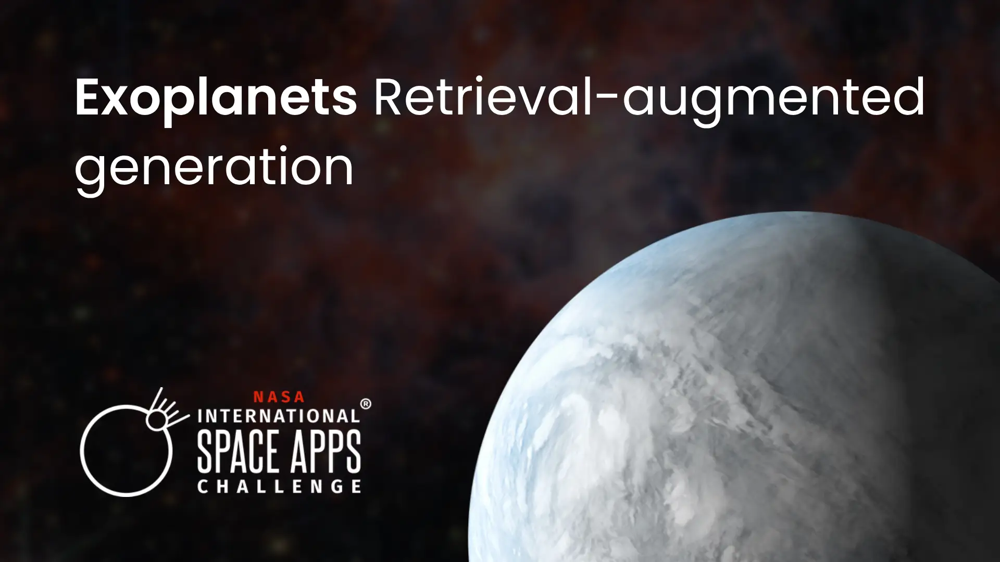
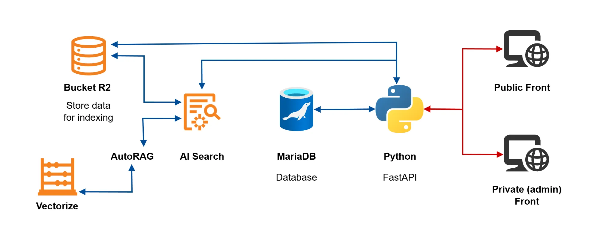
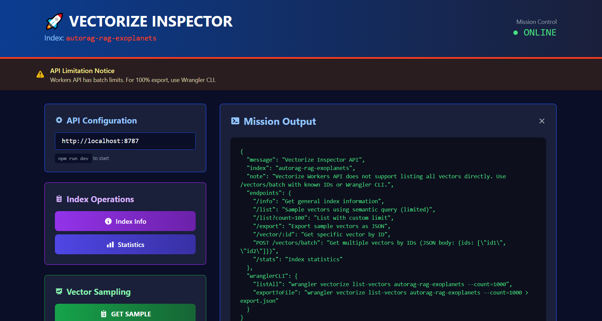
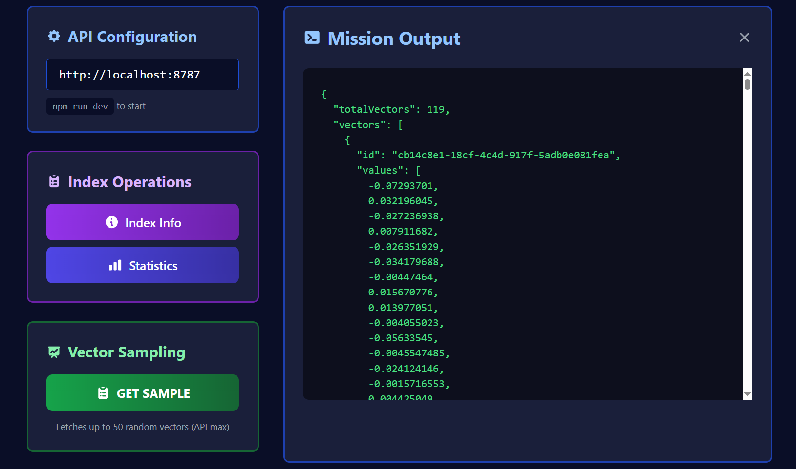
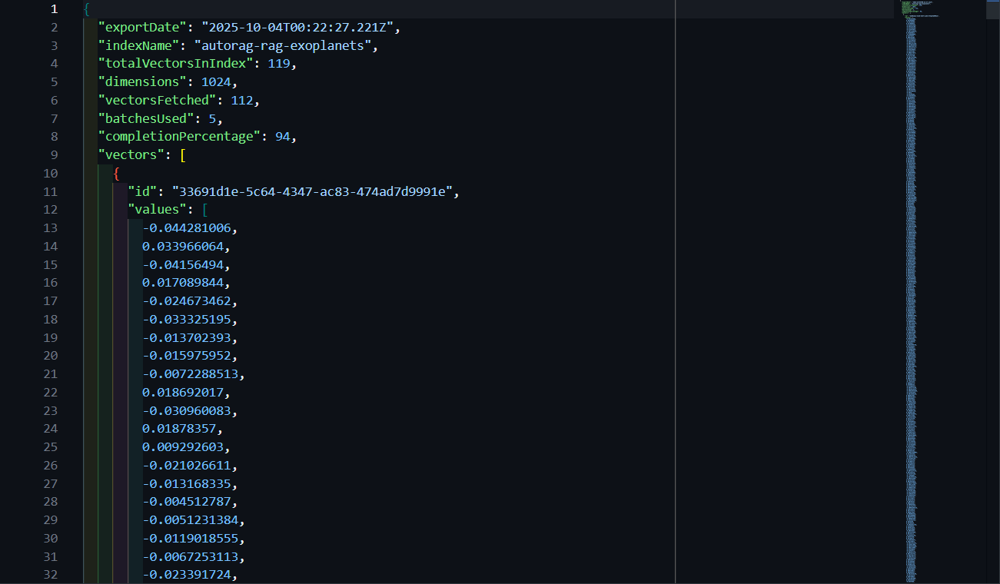

[](LICENSE)
[](https://developer.mozilla.org/en-US/docs/Web/HTML)
[](#)
[](#)
[](#)
[](#)
[](#)
[](https://developers.cloudflare.com/ai-search/)
[](https://www.cloudflare.com/products/r2/)

# Exoplanets Retrieval-augmented generation

Web application for querying NASA information using artificial intelligence.



Photos by: [NASA Images](https://www.nasa.gov/images/) and edited in [Photopea](https://www.photopea.com/).

---

## Technology Stack

The project uses modern technologies, allowing users to access two websites: a public frontend and an admin frontend. Both are static sites that connect via endpoints to a Python backend, which interacts with a MariaDB database. The backend also consumes Cloudflare AI Search via REST API for intelligent retrieval-augmented generation capabilities and manages file storage (specifically vector files for RAG) in a Cloudflare R2 bucket.


Diagram generated with [diagrams.net](https://app.diagrams.net/).


### Detailed Overview of technologies

- **MariaDB**: Serves as the primary SQL database for storing user information and general service data.

- **Python & FastAPI**: FastAPI is used to build backend endpoints for seamless communication between services.

- **Argon2id**: Utilized for secure password hashing, ensuring robust protection of user credentials.

- **Websites**: Both public and admin sites are deployed as static assets on Cloudflare Workers for high performance and scalability.

- **Cloudflare AI Search** (formerly known as AutoRAG): Configured via Cloudflare Dashboard and consumed through REST API to provide intelligent search capabilities powered by retrieval-augmented generation. This service combines vector search with LLM-based generation for accurate and contextual responses. [Documentation](https://developers.cloudflare.com/ai-search/)

  **API Endpoints:**
  - **AI Search**: `POST /accounts/{ACCOUNT_ID}/ai-search/rags/{AUTORAG_NAME}/ai-search` - Searches for relevant results and generates a response using the configured model
  - **Search**: `POST /accounts/{ACCOUNT_ID}/ai-search/rags/{AUTORAG_NAME}/search` - Searches and returns relevant results without generation

  **Example Request:**
  ```bash
  curl https://api.cloudflare.com/client/v4/accounts/{ACCOUNT_ID}/ai-search/rags/{AUTORAG_NAME}/ai-search \
  -H 'Content-Type: application/json' \
  -H "Authorization: Bearer {API_TOKEN}" \
  -d '{
    "query": "What is an exoplanet?",
    "model": "@cf/meta/llama-3.3-70b-instruct-fp8-fast",
    "max_num_results": 10,
    "ranking_options": { "score_threshold": 0.4 },
    "stream": true
  }'
  ```

- **Cloudflare R2**: Used to store data for indexing, enabling efficient retrieval and management of vector files. Supports a wide variety of file formats with comprehensive ingestion capabilities. [Learn more](https://developers.cloudflare.com/ai-search/configuration/data-source/r2/)

  **File Size Limits:**
  - **Plain text files**: Up to 4 MB
  - **Rich format files**: Up to 4 MB
  - Files exceeding these limits will not be indexed and will appear in error logs

  **Supported Plain Text File Types:**
  
  - Text: `.txt`, `.rst`
  - Log: `.log`
  - Config: `.ini`, `.conf`, `.env`, `.properties`, `.gitignore`, `.editorconfig`, `.toml`
  - Markdown: `.markdown`, `.md`, `.mdx`
  - LaTeX: `.tex`, `.latex`
  - Script: `.sh`, `.bat`, `.ps1`
  - SGML: `.sgml`
  - JSON: `.json`
  - YAML: `.yaml`, `.yml`
  - CSS: `.css`
  - JavaScript: `.js`
  - PHP: `.php`
  - Python: `.py`
  - Ruby: `.rb`
  - Java: `.java`
  - C: `.c`
  - C++: `.cpp`, `.cxx`
  - C Header: `.h`, `.hpp`
  - Go: `.go`
  - Rust: `.rs`
  - Swift: `.swift`
  - Dart: `.dart`

  **Supported Rich Format File Types:**
  
  Rich format files are automatically converted to Markdown using AI Search's Markdown Conversion feature.
  
  - PDF Documents: `.pdf`
  - Images: `.jpeg`, `.jpg`, `.png`, `.webp`, `.svg`
  - HTML Documents: `.html`
  - XML Documents: `.xml`
  - Microsoft Office: `.xlsx`, `.xlsm`, `.xlsb`, `.xls`, `.et`, `.docx`
  - Open Document: `.ods`, `.odt`
  - CSV: `.csv`
  - Apple Documents: `.numbers`

- **AI Model for Vectorization**: `@cf/baai/bge-m3` - Embedding model used for converting data into vectors during index generation. Developed by the Beijing Academy of Artificial Intelligence (BAAI). [Hugging Face](https://huggingface.co/BAAI/bge-m3) | [BAAI](https://www.baai.ac.cn/)
  
  **Configuration:**
  - **Chunk Size**: 265 tokens
    - Controls the number of tokens per chunk
    - Affects search accuracy and context preservation
  - **Chunk Overlap**: 10%
    - Controls the overlap between consecutive chunks
    - Maintains related information together across boundaries

- **Cloudflare Vectorize**: Distributed vector database that makes querying embeddings (representations of values or objects like text, images, and audio that are designed to be consumed by machine learning models and semantic search algorithms) faster, easier, and more affordable. This service stores and efficiently retrieves the vector embeddings generated by the vectorization model. [Read more](https://developers.cloudflare.com/vectorize/)

- **Generation Model**: `@cf/meta/llama-3.3-70b-instruct-fp8-fast` - Large language model that powers the text generation capabilities for providing contextual responses. [Llama](https://www.llama.com/)
  
  **Configuration:**
  - **Query Rewriting**: Disabled
  - **Maximum Results**: 10
    - Controls the maximum number of results returned per query
  - **Match Threshold**: 0.4
    - Minimum score required for a result to be considered a match
    - Range: 0.0 to 1.0
  - **Similarity Cache**: Strong
    - Optimized for high semantic similarity matching

**Methodology:** The project follows the JAMStack approach for modern, decoupled web architecture.

---

### Backend

- **FastAPI**: Python server framework used to create RESTful API endpoints for communication between the frontend and backend services.

---

### Frontend admin

---

### Frontend public

---

### Database

**MariaDB**: Scripts to create the database and tables structure.

The `database/` folder contains SQL scripts that must be executed in order:

1. **01_create_database.sql** - Creates the `exoplanets-rag` database if it doesn't exist
2. **02_create_tables.sql** - Creates the tables: `users`, `files`, and `responses` with their relationships
3. **03_insert_initial_data.sql** - Inserts initial data (optional)

---

### Utils

**Vectorize inspector:** A Cloudflare Worker app that allows inspecting the contents of the "Vectorize" indexes.

Preview:


Vector sample:


Vector exported as JSON:


---

Open-source project created for the NASA Space Apps Challenge 2025.

Challenge: A World Away: Hunting for Exoplanets with AI
https://www.spaceappschallenge.org/2025/challenges/a-world-away-hunting-for-exoplanets-with-ai/

A global hackathon organized by NASA: https://www.nasa.gov/

In partnership with:

- Bahrain Space Agency: https://www.bsa.bh/
- Brazilian Space Agency: https://www.gov.br/aeb/pt-br
- Canadian Space Agency: https://www.asc-csa.gc.ca/eng/
- European Space Agency: https://www.esa.int/
- Indian Space Research Organization: https://www.isro.gov.in/
- Italian Space Agency: https://www.asi.it/en/
- Japan Aerospace Exploration Agency: https://global.jaxa.jp/
- Mohammed Bin Rashid Space Centre: https://www.mbrsc.ae/
- National Space Activities Commission of Argentina: https://www.argentina.gob.ar/ciencia/conae
- Paraguayan Space Agency: https://aep.gov.py/
- South African National Space Agency: https://www.sansa.org.za/
- Spanish Space Agency: https://www.aee.gob.es/
- Turkish Space Agency: https://tua.gov.tr/en
- UK Space Agency: https://tua.gov.tr/en

## Special thanks

We extend our sincere appreciation to the Universidad De Monterrey (UDEM), located at Av. Ignacio Morones Prieto 4500-Pte, Zona Valle Poniente, 66238 San Pedro Garza García, N.L., as well as the NASA Space Apps Challenge organizers for their organization and facilitation of the "NASA Space Apps Challenge 2025" Hackathon. This event took place on their premises, where open-source projects were diligently crafted, aiming for pioneering solutions.

